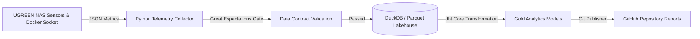

# 🖥️ Auto-DataPulse: UGREEN NAS Infrastructure Telemetry & Lakehouse Engine

[](https://github.com/siddharthsbhadauria/auto-datapulse/actions/workflows/ci_dbt_test.yml)

**Auto-DataPulse** is a self-hosted, containerized mini-Lakehouse and telemetry pipeline optimized for **UGREEN NAS (32 GB RAM)**. It continuously collects host performance metrics, checks data contract assertions via **Great Expectations**, transforms metrics using **DuckDB + dbt Core**, and automatically commits daily infrastructure health logs to GitHub.

---

## 🏗️ System Architecture



---

## 🛠️ Tech Stack & Engineering Competencies

* **Container Infrastructure**: Docker, Docker Compose, Portainer.
* **Storage & Query Engine**: DuckDB (Embedded OLAP) & Apache Parquet.
* **Data Transformation**: `dbt-core` & `dbt-duckdb`.
* **Data Governance & Contracts**: Great Expectations schema assertion engine.
* **Automation**: Python 3.11, GitPython.

---

## 🚀 Deployment on UGREEN NAS (Portainer)

### 1. Environment Variable Setup
Create a `.env` file on your NAS:
```env
GITHUB_TOKEN=your_github_personal_access_token
GITHUB_REPO=siddharthsbhadauria/auto-datapulse
POLL_INTERVAL_SECONDS=900
```

### 2. Deploy via Docker Compose
```bash
docker-compose up -d --build
```

---

## 🛡️ License
Distributed under the MIT License.
