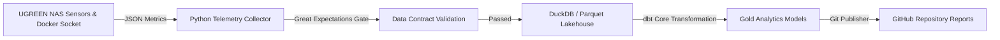

# 🖥️ Auto-DataPulse: UGREEN NAS Infrastructure Telemetry & Lakehouse Engine

[](https://github.com/siddharthsbhadauria/auto-datapulse/actions/workflows/ci_dbt_test.yml)

**Auto-DataPulse** is a self-hosted, containerized mini-Lakehouse and telemetry pipeline optimized for **UGREEN NAS (32 GB RAM)**. It continuously collects host performance metrics, checks data contract assertions via **Great Expectations**, transforms metrics using **DuckDB + dbt Core**, and automatically commits daily infrastructure health logs to GitHub.

---

## 🏗️ System Architecture



---

## 🛠️ Tech Stack & Engineering Competencies

* **Container Infrastructure**: Docker, Docker Compose, Portainer.
* **Storage & Query Engine**: DuckDB (Embedded OLAP) & Apache Parquet.
* **Data Transformation**: `dbt-core` & `dbt-duckdb`.
* **Data Governance & Contracts**: Great Expectations schema assertion engine.
* **Automation**: Python 3.11, GitPython.

---

## 🚀 Deployment Instructions on UGREEN NAS (Portainer)

### Option 1: Portainer Stacks (Git Repository Mode - Recommended)

1. Open **Portainer** on your NAS (`http://<NAS-IP>:9000`) ➔ **Stacks** ➔ **+ Add stack**.
2. Set Stack Name: `auto-datapulse`.
3. Select **Repository** build mode:
   - **Repository URL**: `https://github.com/siddharthsbhadauria/auto-datapulse.git`
   - **Repository reference**: `refs/heads/main`
   - **Compose path**: `docker-compose.yml`
4. Add **Environment Variables** in the Portainer UI:
   - `GITHUB_TOKEN`: `your_personal_access_token`
   - `DATA_PATH`: `/volume2/docker/auto-datapulse/data`
   - `REPORTS_PATH`: `/volume2/docker/auto-datapulse/REPORTS`
5. Click **Deploy the stack**. Portainer will automatically pull the repo, build the Docker container image, map your `/volume2/docker` persistent storage, and start the service 24/7.

---

### Option 2: NAS Terminal / SSH CLI

```bash
# 1. SSH into your NAS and navigate to docker volume directory
cd /volume/docker

# 2. Clone repository
git clone https://github.com/siddharthsbhadauria/auto-datapulse.git
cd auto-datapulse

# 3. Create .env file with custom volume paths and token
echo "GITHUB_TOKEN=your_personal_access_token" > .env
echo "DATA_PATH=/volume2/docker/auto-datapulse/data" >> .env
echo "REPORTS_PATH=/volume2/docker/auto-datapulse/REPORTS" >> .env

# 4. Build and start container in background
docker-compose up -d --build
```

---

## 🛡️ License
Distributed under the MIT License.
